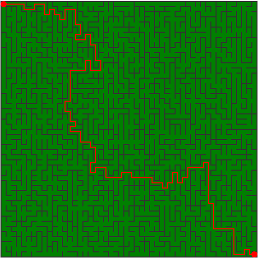
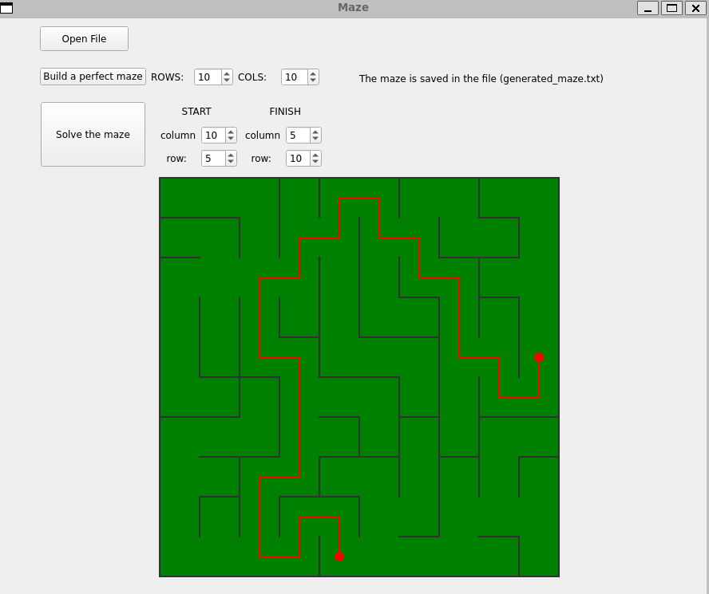

# Maze_CPP

## Introduction
Implementation of the Maze program. This program generates an ideal maze using the Eller algorithm and also finds the shortest path between two points, as well as reads and saves the generated maze as a file
 

## Interface
Simple and intuitive interface

## Development Details

- The program developed in C++ language of C++17 standard
- The program is built with Makefile which contains standard set of targets for GNU-programs: all, install, uninstall, clean, dvi, dist, tests. 
- GUI implementation - Qt frameework
- The program has a button to load the maze from a file
- Maximum size of the maze is
  50x50
- The loaded maze is rendered on the screen in a field of 500 x 500 pixels
- "Wall" thickness is 2 pixels
- - The program generates a perfect maze according to Eller's algorithm. A maze is considered perfect if it is possible to get from each point to any other point in exactly one way.
- The generated maze must not have isolations and loops
- The route, which is the solution, is displayed with a line 2 pixel thick, passing through the middle of all the cells in the maze through which the solution runs.